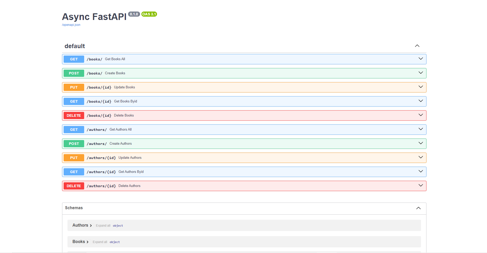

# CRUD FastAPI Framework

This is CRUD Application using SQLAlchemy.



## Set Up Project

1. clone repo `https://github.com/Alamnzr123/starterpack_python`
2. Install package: 
```
pip install databases
pip install databases[postgresql]
pip install asyncpg
```
4. Add `db.py`

```
import os
from databases import Database
from dotenv import load_dotenv
import sqlalchemy
BASE_DIR = os.path.dirname(os.path.abspath(__file__))
load_dotenv(os.path.join(BASE_DIR, ".env"))

db = Database(os.environ["DATABASE_URL"])
metadata = sqlalchemy.MetaData()
```

5. Add `app.py`

```
from db import db
from fastapi import FastAPI


app = FastAPI(title="Async FastAPI")


@app.on_event("startup")
async def startup():
    await db.connect()


@app.on_event("shutdown")
async def shutdown():
    await db.disconnect()
```

6. Add Model Author and Model Books `models/`

```models/author
import sqlalchemy
from db import db, metadata, sqlalchemy
from fastapi import HTTPException

authors = sqlalchemy.Table(
    "authors",
    metadata,
    sqlalchemy.Column("id", sqlalchemy.Integer, primary_key=True),
    sqlalchemy.Column("name", sqlalchemy.String),
    sqlalchemy.Column("bio", sqlalchemy.String),
    sqlalchemy.Column("birth_date", sqlalchemy.String),
)


class Authors:
    @classmethod
    async def get_all(cls):
        query = authors.select()
        author = await db.fetch_all(query)
        return author

    @classmethod
    async def get_byId(cls, id):
        query = authors.select().where(authors.c.id == id)
        author = await db.fetch_one(query)

         # Check if id exists. If not, return 404 not found response
        if not author:
            raise HTTPException(status_code=404, detail=f"Task with id {id} not found")
        return author

    @classmethod
    async def create(cls, **author):
        query = authors.insert().values(**author)
        author_id = await db.execute(query)
        return author_id
    
    @classmethod
    async def update_authors(cls, id, **author):
        query = authors.select().where(authors.c.id == id)
        get_author = await db.fetch_one(query)

        if get_author:
            query2 = authors.update().values(**author)
            await db.execute(query2)

        # Check if id exists. If not, return 404 not found response
        if not get_author:
            raise HTTPException(status_code=404, detail=f"Task with id {id} not found")

        return get_author
    
    @classmethod
    async def delete_authors(cls, id):
        query = authors.delete().where(authors.c.id == id)
        await db.fetch_one(query)
        
```


```models/books
import sqlalchemy
from sqlalchemy.sql import func
from db import db, metadata, sqlalchemy
from fastapi import HTTPException

books = sqlalchemy.Table(
    "books",
    metadata,
    sqlalchemy.Column("id", sqlalchemy.Integer, primary_key=True),
    sqlalchemy.Column("title", sqlalchemy.String),
    sqlalchemy.Column("description", sqlalchemy.String),
    sqlalchemy.Column("publish_date", sqlalchemy.DateTime(timezone=True), server_default=func.now()),
    sqlalchemy.Column("author_id", sqlalchemy.String),
)


class Books:
    @classmethod
    async def get_all(cls):
        query = books.select()
        book = await db.fetch_all(query)
        return book

    @classmethod
    async def get_byId(cls, id):
        query = books.select().where(books.c.id == id)
        book = await db.fetch_one(query)

         # Check if id exists. If not, return 404 not found response
        if not book:
            raise HTTPException(status_code=404, detail=f"Task with id {id} not found")
        return book

    @classmethod
    async def create(cls, **book):
        query = books.insert().values(**book)
        book_id = await db.execute(query)
        return book_id
    
    @classmethod
    async def update_books(cls, id, **book):
        query = books.select().where(books.c.id == id)
        get_book = await db.fetch_one(query)

        if get_book:
            query2 = books.update().values(**book)
            await db.execute(query2)

        # Check if id exists. If not, return 404 not found response
        if not get_book:
            raise HTTPException(status_code=404, detail=f"Task with id {id} not found")

        return get_book
    
    @classmethod
    async def delete_books(cls, id):
        query = books.delete().where(books.c.id == id)
        await db.fetch_one(query)
        
```

7. Add Controller and Routes

```
import uvicorn
from models.books import Books as ModelBooks
from models.authors import Authors as ModelAuthors
from config.schemaBooks import Books as SchemaBooks
from config.schemaAuthors import Authors as SchemaAuthors
from typing import List
from app import app

# Books Routes
@app.post("/books/")
async def create_books(create_books: SchemaBooks):
    books_id = await ModelBooks.create(**create_books.model_dump())
    return {"books_id": books_id}

@app.put("/books/{id}")
async def update_books(id: int, create_books: SchemaBooks):
    books_id = await ModelBooks.update_books(id, **create_books.model_dump(exclude_unset=True))
    return {"books_id": books_id}

@app.get("/books/", response_model=List[SchemaBooks])
async def get_books_All():
    book = await ModelBooks.get_all()
    return book


@app.get("/books/{id}", response_model=SchemaBooks)
async def get_books_byId(id: int):
    book = await ModelBooks.get_byId(id)
    return SchemaBooks(**book).dict()

@app.delete("/books/{id}")
async def delete_books(id: int):
     await ModelBooks.delete_books(id)
     return {"message": "Data Delete"}


# Authors Routes

@app.post("/authors/")
async def create_authors(create_author: SchemaAuthors):
    books_id = await ModelAuthors.create(**create_author.model_dump())
    return {"books_id": books_id}

@app.put("/authors/{id}")
async def update_authors(id: int, create_author: SchemaAuthors):
    books_id = await ModelAuthors.update_authors(id, **create_author.model_dump(exclude_unset=True))
    return {"books_id": books_id}

@app.get("/authors/", response_model=List[SchemaAuthors])
async def get_authors_All():
    book = await ModelAuthors.get_all()
    return book


@app.get("/authors/{id}", response_model=SchemaAuthors)
async def get_authors_byId(id: int):
    book = await ModelAuthors.get_byId(id)
    return SchemaBooks(**book).dict()

@app.delete("/authors/{id}")
async def delete_authors(id: int):
     await ModelAuthors.delete_authors(id)
     return {"message": "Data Delete"}

if __name__ == "__main__":
    uvicorn.run(app, host="0.0.0.0", port=8000)

```

8. Modify Alembic config `alembic/env.py`

FROM 
```
import models

target_metadata = models.Base.metadata
```

TO 

```
# ---------------- added code here -------------------------#
import models.authors
import models.books
from db import metadata
#------------------------------------------------------------#

# ---------------- changed code here -------------------------#
# here target_metadata was equal to None
target_metadata = metadata
#------------------------------------------------------------#

```

9. Add `.env`

10. make our first migration on PostgreSQL :

```
alembic revision --autogenerate -m "First migration"
```

11. run the migration :

```
alembic upgrade head
```

12. Run SERVER/APP :

```
uvicorn main:app --reload
```

13. Open PGAdmin4 `POSTGRESQL` and find your DB
14. Open `http://127.0.0.1:8000/docs` FASTAPI SERVER to CREATE, GET data
or using POSTMAN
15. DONE.

* IGNORE THE `Pipfile` using pip package manager

## Package

alembic
fastAPI
Pydantic

## Programming Language
Python